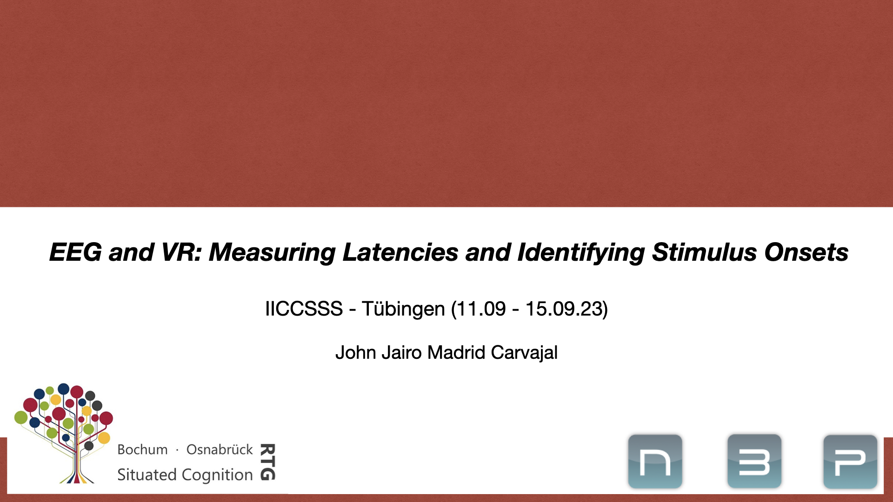

The purpose of this repository is to learn about measuring latencies and identifying stimulus onsets for experiments 
combining electroencephalogram (EEG) and virtual reality (VR). We used Unity 3D to design a virtual environment and
Lab Streaming Layer (LSL) to simultaneously collect, synchronize, and store the data. 

The repository contains:
- <strong>latency-tests.ipynb:</strong> It containing tasks to learn how to process .XDF files and how to design and analyze 
devices' latencies previous to start the recording phase.
- <strong>trigger-onsets.ipynb:</strong> It contains tasks to learn how to identify stimulus onsets and create the trigger 
files used for even related potential analysis (ERP).
- <strong>data:</strong> folder for the latency test files.
- <strong>data-onset:</strong> folder for the experiment file.

### To create the environment:

`Python 3.8` or higher

1. Create a folder and place `requirements.txt`
2. From the terminal, go to the created folder and run:

For <strong>Windows:</strong> 
`python -m venv iiccsss-eeg`

And then, `iiccsss-eeg\Scripts\python -m pip install -r requirements.txt`

For <strong>Mac/Linux:</strong> 
`python3 -m venv iiccsss-eeg`

And then, `iiccsss-eeg/bin/python -m pip install -r requirements.txt`

